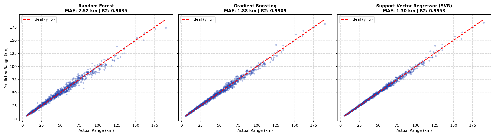

# Electric Vehicle Driving Range Prediction

A machine learning framework for predicting real-world remaining driving range in Battery Electric Vehicles (BEVs), specifically calibrated for the 2013 Nissan Leaf (24 kWh battery pack) based on the University of Michigan Vehicle Energy Dataset (VED) telemetry schema.

---

## 1. Overview

Accurate driving range estimation is critical to mitigating driver range anxiety. This repository implements an end-to-end regression pipeline that accounts for non-linear physical dynamics:
* **Aerodynamic drag losses** scaling with the cube of speed ($P_{\text{drag}} \propto v^3$).
* **Electro-chemical degradation** in sub-zero winter temperatures.
* **Cabin HVAC energy consumption** (PTC heaters and A/C compressor).
* **Gravitational resistance** on road inclines.

Three regression models were evaluated: **Random Forest Regressor**, **Gradient Boosting Regressor**, and **Support Vector Regressor (SVR)**. **SVR with a Radial Basis Function (RBF) kernel** achieved the highest accuracy ($R^2 = 0.9953, \text{MAE} = 1.30\text{ km}$) and was deployed as the primary model.

---

## 2. Model Performance Scoreboard

Evaluated on an unseen 20% test holdout (1,000 driving trips):

| Model Architecture | Mean Absolute Error (MAE) | Root Mean Squared Error (RMSE) | Coefficient of Determination ($R^2$) | Status |
| :--- | :---: | :---: | :---: | :---: |
| **Support Vector Regressor (SVR)** | **1.30 km** | **1.92 km** | **0.9953** | **Deployed Champion** |
| **Gradient Boosting Regressor** | **1.88 km** | **2.69 km** | **0.9909** | Baseline Comparison |
| **Random Forest Regressor** | **2.52 km** | **3.61 km** | **0.9835** | Baseline Comparison |

### Actual vs. Predicted Range Comparison


---

## 3. Repository Structure

```text
.
├── .gitignore                         # Standard git ignore rules
├── README.md                          # Project documentation and guide
├── requirements.txt                   # Python package dependencies
├── app.py                             # Interactive Streamlit Web Application
│
├── data/
│   └── ev_driving_dataset.csv         # 5,000 trip records (VED Nissan Leaf specification)
│
├── models/
│   └── svr_pipeline.joblib            # Pre-trained SVR pipeline (StandardScaler + SVR)
│
├── notebooks/
│   └── ev_range_prediction.ipynb      # Executable Jupyter Notebook with analysis & plots
│
├── src/
│   ├── __init__.py
│   ├── data_generator.py              # Physics-grounded EV data simulation module
│   ├── train.py                       # Training, benchmarking, and serialization script
│   └── predict.py                     # Standalone CLI inference utility
│
├── assets/
│   └── ev_model_comparison.png        # Benchmark evaluation scatter plot
│
└── docs/
    └── PROJECT_REPORT.md              # Detailed academic/technical report
```

---

## 4. Installation and Setup

### Prerequisites
* Python 3.10 or higher
* Recommended: Virtual environment (`venv` or `conda`)

### Step 1: Clone Repository
```bash
git clone https://github.com/<your-username>/EV-Driving-Range-Prediction.git
cd EV-Driving-Range-Prediction
```

### Step 2: Create and Activate Virtual Environment
```bash
python3 -m venv venv
source venv/bin/activate  # On Windows: venv\Scripts\activate
```

### Step 3: Install Dependencies
```bash
pip install -r requirements.txt
```

---

## 5. Usage

### Launch Interactive Web Application
Start the Streamlit dashboard to simulate real-time driving range across temperature, speed, road slope, and HVAC scenarios:
```bash
streamlit run app.py
```

### Retrain Models
To regenerate the dataset and re-run model benchmarks:
```bash
python src/train.py
```

### Run Standalone CLI Inference
Predict remaining range for sample operational scenarios:
```bash
python src/predict.py
```

### View Jupyter Notebook
Open the notebook in Jupyter Lab or VS Code:
```bash
jupyter lab notebooks/ev_range_prediction.ipynb
```

---

## 6. Real-World Scenario Examples

* **Scenario 1: Harsh Winter Highway**
  * Inputs: $-5^\circ\text{C}$, $100\text{ km/h}$, $80\%\text{ SoC}$, $4.0\text{ kW Heater}$
  * **Predicted Remaining Range:** **39.8 km** (Reflects ~62% range penalty due to cold chemistry and drag).
* **Scenario 2: Mild Spring Urban Commute**
  * Inputs: $+20^\circ\text{C}$, $40\text{ km/h}$, $80\%\text{ SoC}$, $\text{HVAC Off}$
  * **Predicted Remaining Range:** **106.3 km** (Optimal operational efficiency).
* **Scenario 3: Hot Summer Incline**
  * Inputs: $+34^\circ\text{C}$, $60\text{ km/h}$, $50\%\text{ SoC}$, $+4\%\text{ Grade}$, $2.5\text{ kW A/C}$
  * **Predicted Remaining Range:** **37.1 km**.

---

## 7. License
This project is licensed under the Apache License 2.0.
